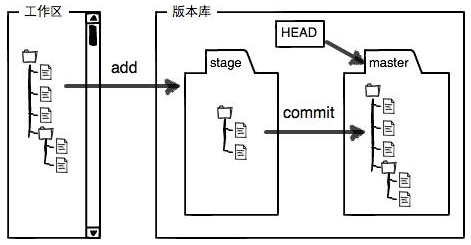
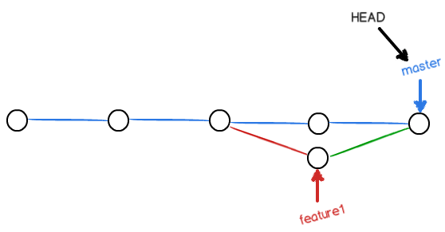

## Intro



`git add` 文件修改从工作区添加到暂存区。

`git commit` 暂存区的所有内容提交到当前分支。创建 Git 版本库时，Git 自动为我们创建了唯一一个 master 分支，故 git commit 就是往 `master` 分支上提交更改。

### git add

`git add .`: 监控工作区的状态树, 将工作时的所有变化提交至暂存区(文件修改(modified), 新文件), 提交`新文件(new)`和`被修改(modified)`, 不包含删除文件

`git add -u`: 仅包含已经被add的文件(tracked file), 将修改的文件提交到暂存区, `不会提交新文件`, 提交`被修改`和`被删除文件`, 不包含新文件

`git add --all || git add -A`: 提交所有变化

### 撤销修改

分如下两种情况：

1. 工作区有修改，但没有 add 也没有 commit，则 `git checkout -- <file>` 将工作区撤销至最近一次 `git add` 或 `git commit` 之后的状态。

2. `git reset` 命令既可以回退版本，也可以把暂存区的修改回退到工作区。`git reset HEAD <file>`。如果再执行 `1`,即可完全撤销。

### 远程仓库

`git push -u origin master`，加上了`-u` 参数，Git 不但会把本地的 master 分支内容推送的远程新的 master 分支，还会把本地的 master 分支和远程的 master 分支关联起来，在以后的推送或者拉取时就可以简化命令。

`git push <remote_branch_host> <local_branch_name>:<remote_branch_name>`

```bash
# 省略远程分支名
# 将本地分支推送到与之存在追踪关系的远程分支, 如果该远程分支不存在则会被创建
git push origin master
# 省略本地分支名
# 删除远程主机上的dev分支
git push origin :dev # 等同 git push origin --delete dev

# 如果当前分支和多个主机之间存在追踪关系, 可以使用这个命令来设置一个默认的主机
git push -u origin master
```

`git pull <remote_host_name> <remote_branch_name>:<local_branch_name>`

```bash
git pull origin next:master
# 等价于
git fetch origin
git merge origin/next
```

如果当前分支与远程分支存在追踪关系, git pull就可以省略远程分支名

`git pull origin`

### 分支管理



```bash
# 创建分支并切换
git checkout -b dev
# 或者
git branch dev && git checkout dev

# 删除分支
git branch -d dev

# 合并分支，合并 dev 到当前分支
# merge conflict，解决冲突后，重新 add and commit
git merge dev

# 显示本地分支及追踪的分支
git branch -vv
# 设置远程追踪
# 设置本地master分支跟踪origin/<branch>远程分支
git branch --set-upstream-to=origin/<branch> master
# or
git branch --set-upstream branch-name origin/branch-name
```

### graph

```bash
git log --graph --pretty=oneline --abbrev-commit
git reflog
git reset --hard HEAD
git reset --hard <commit-id>
```

### Normal

```bash
# clone 指定分支
git clone -b <branch-name> <git-url>
```

## 一些问题

### windows 与 linux 换行符问题

```bash
git config --global core.autocrlf false
git config --global core.safecrlf true
```

### 远程分支/远程跟踪分支/跟踪分支

远程跟踪分支是本地仓库对远程仓库中的某个远程分支的状态的记录, 它们以"(远程仓库名)/(分支名)"形式命名. 例如, 如果你想要看你最后一次与远程仓库 origin 通信时master 分支的状态, 你可以查看 origin/master 分支. 远程跟踪分支的作用是告诉用户其所跟踪的远程分支的状态(即指向哪一个commit), 因而它在本地是只读的, 用户是无法自行修改它的指向. 其指向将在用户与远程仓库通信时自动改变, 这里的通信是指执行诸如git fetch等从远程仓库获取数据的操作.

Git 的 clone 命令会为你自动将其命名为 origin, 拉取它的所有数据, 创建一个指向它的 master 分支的指针, 并且在本地将其命名为 origin/master, 这便是指向远程分支master的远程跟踪分支. Git 也会给你一个与 origin 的 master 分支在指向同一个地方的本地 master 分支, 正是这个本地分支才使得用户可以在本地对 master 分支进行修改.

从一个远程跟踪分支产生出的一个本地分支便是跟踪分支, 该本地分支对应的远程跟踪分支称为上游分支. 跟踪分支是与远程分支有直接关系的本地分支, 当克隆一个仓库时, 它通常会自动地创建一个跟踪 origin/master 的 master 分支. 创建跟踪分支可以使用 `git checkout -b [branch] [remotename]/[branch]`

### .gitignore

```
# 此行为注释

*.log
*.apk

# 仅忽略项目根目录下的todo文件 不包括subdir/todo
/todo

# 忽略build/目录下所有文件 过滤整个build文件夹 包括build
build/
build/:
```

### .gitignore失效问题

```bash
git rm -r --cache .
git add .
git commit -m "update .gitignore"
```
