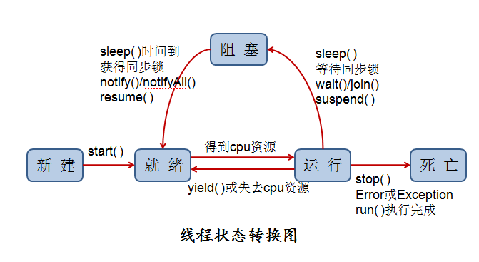
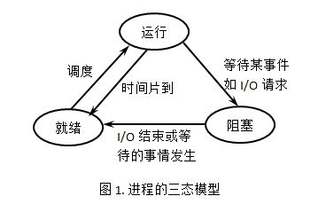

## 系统概述
### Buffers and Synchronization

当我们对文件流进行操作的时候，它们与一个 streambuf 类型的缓存(buffer)联系在一起。这个缓存(buffer)实际是一块内存空间，作为流(stream)和物理文件的媒介。例如，对于一个输出流， 每次成员函数 put (写一个单个字符)被调用，这个字符不是直接被写入该输出流所对应的物理文件中的，而是首先被插入到该流的缓存(buffer)中。

当缓存被排放出来(flush)时，它里面的所有数据或者被写入物理媒质中（如果是一个输出流的话），或者简单的被抹掉(如果是一个输入流的话)。这个过程称为同步(synchronization)，它会在以下任一情况下发生：

当文件被关闭时：在文件被关闭之前，所有还没有被完全写出或读取的缓存都将被同步。 当缓存 buffer 满时:缓存 Buffers 有一定的空间限制。当缓存满时，它会被自动同步。 控制符明确指明：当遇到流中某些特定的控制符时，同步会发生。这些控制符包括：flush 和 endl。 明确调用函数 sync()：调用成员函数 sync() (无参数)可以引发立即同步。这个函数返回一个 int 值，等于 -1 表示流没有联系的缓存或操作失败。

### 并发与并行

并发：宏观上在一段时间内能够运行多个程序；引入进程和线程使程序能够并发运行

并行：同一时刻能运行多个指令；需要硬件支持，如多流水线、多核处理器、分布式计算系统

### 共享

共享是指系统中的资源可以被多个并发进程共同使用。
有两种共享方式：互斥共享和同时共享。
互斥共享的资源称为临界资源，例如打印机等，在同一时刻只允许一个进程访问，需要用同步机制来实现互斥访问。

### 阻塞非阻塞与同步异步



阻塞与非阻塞的概念是针对 IO 状态而言的，关注程序在等待 IO 调用返回这段时间的状态。当线程或进程调用每一个函数的时候，如果需要等待 I/O 请求等待竞争资源的时候，操作系统就绪将其阻塞起来，避免浪费更多的 CPU 资源。等待完成之后，将其转换为就绪状态继续运行。

阻塞和非阻塞，以及同步和异步，完全是两组概念且之间并没有一个必然的联系。也就是阻塞并不等于同步，非阻塞并不等于异步。

同步和异步关注的是消息通信机制，同步，就是在发出一个调用时，在没有得到结果之前，该调用就不返回。但是一旦调用返回，就得到返回值了。换句话说，就是由调用者主动等待这个调用的结果。而异步则是相反，调用在发出之后，这个调用就直接返回了，所以没有返回结果。换句话说，当一个异步过程调用发出后，调用者不会立刻得到结果。而是在调用发出后，被调用者通过状态、通知来通知调用者，或通过回调函数处理这个调用。

- **同步阻塞调用**：得不到结果不返回，线程进入阻塞态等待。
- **同步非阻塞调用**：得不到结果不返回，线程不阻塞一直在 CPU 运行。
- **异步阻塞调用**：去到别的线程，让别的线程阻塞起来等待结果，自己不阻塞。
- **异步非阻塞调用**：去到别的线程，别的线程一直在运行，直到得出结果。

## 进程与线程

对于有线程系统：

- 进程是资源分配的独立单位
- 线程是资源调度的独立单位

对于无线程系统：

- 进程是资源调度、分配的独立单位

### 进程状态切换



- 就绪状态：当进程已分配到除 CPU 以外的所有必要资源后，只要再获得 CPU，便可立即执行，进程这时的状态称为就绪状态。在一个系统中处于就绪状态的进程可能有多个，通常将它们排成一个队列，称为就绪队列。
- 运行状态：进程已获得 CPU，其程序正在执行。在单处理机系统中，只有一个进程处于执行状态；在多处理机系统中，则有多个进程处于执行状态。
- 阻塞状态：正在执行的进程由于发生某事件而暂时无法继续执行时，便放弃处理机而处于暂停状态，亦即进程的执行受到阻塞，把这种暂停状态称为阻塞状态，有时也称为等待状态或封锁状态。致使进程阻塞的典型事件有：请求 I/O，申请缓冲空间等。通常将这种处于阻塞状态的进程也排成一个队列。有的系统则根据阻塞原因的不同而把处于阻塞状态的进程排成多个队列。


- 就绪状态(ready)：等待调度
- 运行状态(running)
- 阻塞状态(waiting)：等待资源
- 只有就绪态和运行态可以互相转换，其他都是单向转换，就绪状态的进程通过调度算法从而获得 CPU 时间，转为运行状态；而运行状态的进程，在分配给它的 CPU 时间片用完之后就会转为就绪状态，等待下一次调度
- 阻塞状态是缺少需要的资源从而由运行状态转换而来，但是该资源不包括 CPU 时间，缺少 CPU 时间会从运行态转换为就绪态

### 同步与互斥

- 同步：多个进程因为合作产生的直接制约关系，使得进程有一定的先后执行关系
- 互斥：多个进程在同一时刻只有一个能进入临界区

### 进程通信

进程间通信方式：

- 管道(pipe)
    - 有名管道：一种半双工通信方式，它允许无亲缘关系进程间的通信
        - 优点：可实现任意关系的进程间通信
        - 缺点：1. 长期存于系统中，使用不当容易出错；2. 缓冲区有限
    - 无名管道：一种半双工的通信方式，只能在具有亲缘关系的进程间使用(父子进程)
        - 优点：简单方便
        - 缺点：1. 局限于单向通信；2. 只能创建在它的进程以及有亲缘关系的进程之间
- 信号量(semaphore)：一个计数器，可以控制多个线程对共享资源的访问，它常作为一种锁机制，防止某进程正在访问共享资源时，其他进程也访问该资源。因此，主要作为进程间以及同一进程内不同线程之间的同步手段
    - 优点：可以同步进程
    - 缺点：信号量有限
- 信号(Signal)：一种比较复杂的通信方式，用于通知接收进程某个事件已经发生
- 消息队列(Message Queue)：是消息的链表，存放在内核中并由消息队列标识符标识
    - 优点：可以实现任意进程间的通信，并通过系统调用函数来实现消息发送和接收之间的同步，无需考虑同步问题，方便
    - 缺点：信息的复制需要额外消耗 CPU 的时间，不适宜于信息量大或操作频繁的场合
- 共享内存(shared memory)：共享内存就是映射一段能被其他进程所访问的内存，这段共享内存由一个进程创建，但多个进程都可以访问。共享内存是最快的 IPC 方式，它是针对其他进程间通信方式运行效率低而专门设计的。它往往与其他通信机制，如信号两，配合使用，来实现进程间的同步和通信
    - 优点：无须复制，快捷，信息量大
    - 缺点：通信是通过将共享空间缓冲区直接附加到进程的虚拟地址空间中来实现的，因此进程间的读写操作的同步问题，利用内存缓冲区直接交换信息，内存的实体存在于计算机中，只能同一个计算机系统中的诸多进程共享，不方便网络通信
- 套接字(socket)：套解口也是一种进程间通信机制，与其他通信机制不同的是，它可用于不同及其间的进程通信
    - 优点：1. 传输数据为字节级，传输数据可自定义，数据量小效率高；2. 传输数据时间短，性能高；3. 适合于客户端和服务器端之间信息实时交互；4. 可以加密,数据安全性强
    - 缺点：需对传输的数据进行解析，转化成应用级的数据

### 线程通信

线程间的通信目的主要用于线程同步，所以线程没有像进程通信中的用于数据交换的通信机制。

- 锁机制
    * 互斥锁/量(mutex)：提供以排他方式防止数据结构被并发修改的方法
    * 读写锁(reader-writer lock)：允许多线程同时读共享数据，而对写操作是互斥的
    * 自旋锁(spin lock)：与互斥锁类似，都是为了保护共享资源，互斥锁是资源被占用，申请者进入睡眠状态；而自旋锁则循环检测保持者是否已经释放锁
    * 条件变量(condition)：可以以原子的方式阻塞进程，直到特定条件为真为止，对条件的测试是在互斥锁的保护下进行的，条件变量始终和锁一起使用
- 信号量机制(semaphore)：
    * 无名线程信号量
    * 有名线程信号量
- 信号机制(signal)：类似进程间的信号处理
- 屏障(barrier)：屏障允许每个线程等待，直到所有的合作线程都达到某一点，然后从该点继续执行

### 示例

```python
import time, threading

# 假定这是你的银行存款:
balance = 0

def change_it(n):
    # 先存后取，结果应该为0:
    global balance
    balance = balance + n
    balance = balance - n

def run_thread(n):
    for i in range(2000000):
        change_it(n)

t1 = threading.Thread(target=run_thread, args=(5,))
t2 = threading.Thread(target=run_thread, args=(8,))
t1.start()
t2.start()
t1.join()
t2.join()
print(balance)
```

```c++
// test() 已经执行完成了，t1 已经被析构了，但是它负责的那个线程还是能够运行，这就是 detach() 的作用
// 如果去掉 main 函数中的 1s 延时，会发现什么都没有打印，因为主线程执行的太快，整个程序已经结束了，那个后台线程被 C++ 运行时库回收了
// 如果将 t1.detach() 换成 t1.join()，test 函数会在 t1 线程执行结束之后，才会执行结束
// 一旦一个线程被分离了，就不能够再被 join 了。如果非要调用，程序就会崩溃，可以使用 joinable() 函数判断一个线程对象能否调用 join()
#include <iostream>
#include <thread>
void function_1() {
    //延时500ms 为了保证test()运行结束之后才打印
    std::this_thread::sleep_for(std::chrono::milliseconds(500));
    std::cout << "I'm function_1()" << std::endl;
}
void test() {
    std::thread t1(function_1);
    t1.detach();
    // t1.join();
    std::cout << "test() finished" << std::endl;
}
int main() {
    test();
    //让主线程晚于子线程结束
    std::this_thread::sleep_for(std::chrono::milliseconds(1000)); //延时1s
    return 0;
}
```

- [mutex](https://www.jianshu.com/p/8ff671d22aa8)

**信号量/PV操作/四个经典进程同步问题**

- [ref](https://www.jianshu.com/p/9017ea75c15a)

**1. 信号量**

信息量的数据结构是一个值和一个指针，指针指向等待该信号量的下一个进程。信号量的值与相应资源的使用情况有关。当它的值大于 0 时，表示当前可用资源的数量；当它的值小于 0 时，其绝对值表示等待使用该资源的进程个数。注意，信号量的值仅能由 PV 操作来改变。

进程间通信处理同步互斥的机制。信号量是一个计数器，可以用来控制多个进程对共享资源的访问。它常作为一种锁机制，防止某进程正在访问共享资源时，其他进程也访问该资源。

**2. PV 操作**

PV 操作由 P 操作原语和 V 操作原语组成(原语是不可中断的过程)，针对信号量进行相应的操作。

- P(S)
    - 将信号量 S 减 1，S -= 1
    - if S < 0，该进程进入阻塞队列
    - if S >= 0，该进程继续执行
- V(S)
    - S += 1
    - if S > 0，该进程继续执行
    - if S < 0，该进程进入阻塞队列

### 资源

进程间私有和共享的资源

- 私有：地址空间、堆、全局变量、栈、寄存器
- 共享：代码段、公共数据、进程目录、进程 ID

线程间私有和共享的资源

- 私有：线程栈、寄存器、程序计数器
- 共享：堆、地址空间、全局变量、静态变量


## Coroutine

是在执行函数 A 时，可以随时中断，去执行函数 B，然后中断继续执行函数 A（可以自由切换）。但这一过程并不是函数调用（没有调用语句），这一整个过程看似像多线程，然而协程只有一个线程执行。执行效率极高，因为子程序切换（函数）不是线程切换，由程序自身控制，没有切换线程的开销。所以与多线程相比，线程的数量越多，协程性能的优势越明显。不需要多线程的锁机制，因为只有一个线程，也不存在同时写变量冲突，在控制共享资源时也不需要加锁，因此执行效率高很多。协程可以处理 IO 密集型程序的效率问题，但是处理 CPU 密集型不是它的长处，如要充分发挥 CPU 利用率可以结合多进程+协程。
